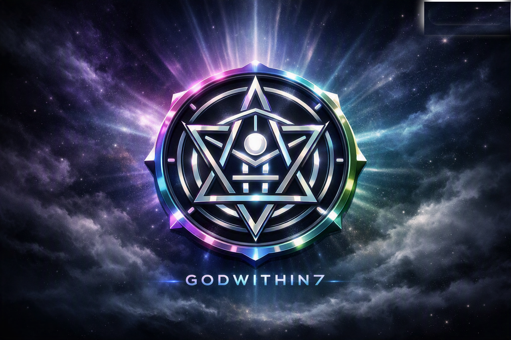
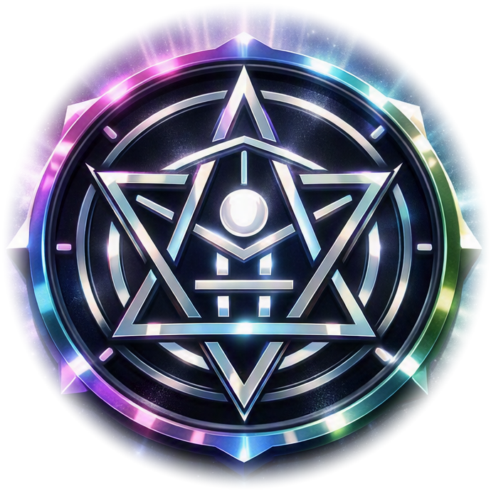

  

    

  

  # GODWthIN7
  ### The Inner Engine of Emergent Intelligence

  
  
  

---

## 🌌 Overview

**GODWthIN7** is the structured, domain-validated inner engine powering the **Devine‑Emergamce** cognitive ecosystem. Designed for deterministic safety, verifiable agent transitions, and emergent multi-agent coordination, it provides the core infrastructure for building intelligent agent systems.

---

## ⚡ Core Architectural Pillars

- **Domain-Validated Transitions:** Invariant state verification preventing non-deterministic corruption.
- **Custody Safety Layer:** Provable asset custody, verifiable identity, and safe execution boundaries.
- **Request Tracing & Lineage:** End-to-end telemetry and execution lineage across prompt graphs and tool dispatches.
- **Emergent Behavior Scaffolding:** Mathematical boundaries allowing complex multi-agent intelligence to evolve safely.

---

## 🔯 The Sacred Geometry of 7

The central emblem incorporates a 7-pointed sacred geometry heptagram encased in a chromatic continuous-validation ring:
1. **Intelligence** — Sovereign awareness and reasoning core
2. **Custody** — Cryptographic and domain-bounded memory safety
3. **Transition** — Predicate-governed state transformations
4. **Tracing** — Hierarchical observability and execution lineage
5. **Emergence** — High-order collective problem solving
6. **Balance** — Harmonic equilibrium between logic and exploration
7. **Sovereignty** — Autonomous agency and consensus

---

## 🗺️ Roadmap Summary

- **Phase 1 — Foundation (Active):** Symbolic identity, transition safety harness, custody protocol, agent substrate.
- **Phase 2 — Expansion (Upcoming):** Multi-agent orchestration, deep request tracing, domain error hardening, GitHub Sponsors integration.
- **Phase 3 — Emergence (Horizon):** Adaptive multi-agent synthesis, symbolic reasoning ontology, decentralized ecosystem SDKs.

---

## ✦ Sponsorship & Support

Support the open-source engineering and cognitive research behind GODWthIN7:

| Tier | Price | Highlights |
| :--- | :--- | :--- |
| 🌱 **Supporter** | $5 / mo | Backer recognition in README & updates |
| 🔧 **Builder** | $15 / mo | Early access to SDK releases & Discord role |
| 🚀 **Architect** | $50 / mo | Priority issue review & quarterly advisory call |
| 🌌 **Visionary** | $100 / mo | Emergent research sponsorship & direct consultation |

👉 [**Become a Sponsor on GitHub**](https://github.com/sponsors/GODWthIN7)

---

## 📜 License & Acknowledgments

Part of the **Devine-Emergamce** ecosystem. Built with sacred geometry, rigorous domain typing, and open-source intelligence.

